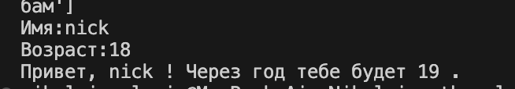
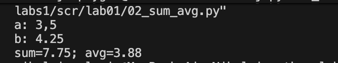
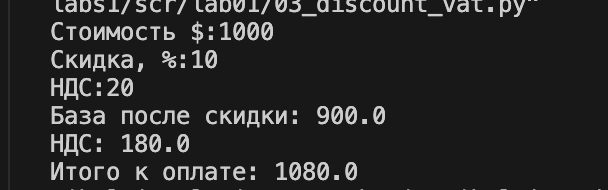
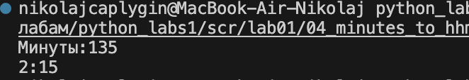
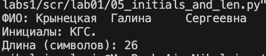

#Лабораторные работы

#Лабораторная работа №1
## Задание 1

```python
a = (input('Имя:'))
b = int(input('Возраст:'))
print('Привет,'+ str(a) + '! Через год тебе будет'+ str(b+1)+'.')
```


## Задание 2

```python
a = float(input("a: ").replace(',', '.'))
b = float(input("b: ").replace(',', '.'))
print('sum='+str(a+b)+'; avg='+str((a+b)/2))
```


## Задание 3

```python
price = int(input('Стоимость $:'))
discount = int(input('Скидка, %:'))
vat = int(input('НДС:'))
base = price * (1 - discount/100)
vat_amount = base * (vat/100)
total = base + vat_amount
print('База после скидки:', base)
print('НДС:',vat_amount)
print('Итого к оплате:',total)
```


## Задание 4

```python
minutes_input = int(input('Минуты:'))
hour = 60
hours = minutes_input//hour
minutes = minutes_input-(hours*hour)
print(str(hours) + ':' + str(minutes))
```


## Задание 5

```python
full_name = input()
cleaned_name = ' '.join(full_name.split())
x = full_name.split()
print(f'ФИО:{cleaned_name}')
print(f'Инициалы:{x[0][0]}{x[1][0]}{x[2][0]}.')
print(f'Длина (символов):{len(cleaned_name)}')
```
