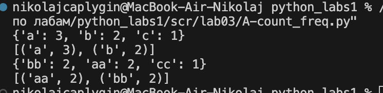
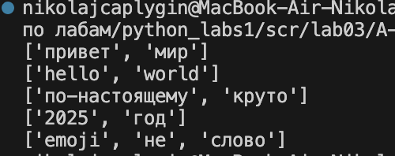
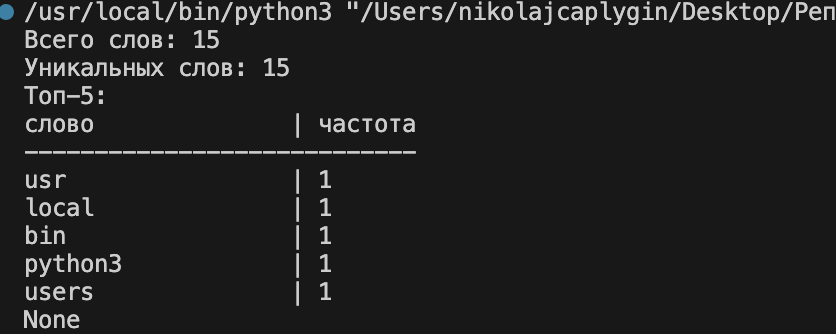

#Лабораторные работы

#Лабораторная работа №1
## Задание 1

```python
a = (input('Имя:'))
b = int(input('Возраст:'))
print('Привет,'+ str(a) + '! Через год тебе будет'+ str(b+1)+'.')
```


## Задание 2

```python
a = float(input("a: ").replace(',', '.'))
b = float(input("b: ").replace(',', '.'))
print('sum='+str(a+b)+'; avg='+str((a+b)/2))
```


## Задание 3

```python
price = int(input('Стоимость $:'))
discount = int(input('Скидка, %:'))
vat = int(input('НДС:'))
base = price * (1 - discount/100)
vat_amount = base * (vat/100)
total = base + vat_amount
print('База после скидки:', base)
print('НДС:',vat_amount)
print('Итого к оплате:',total)
```


## Задание 4

```python
minutes_input = int(input('Минуты:'))
hour = 60
hours = minutes_input//hour
minutes = minutes_input-(hours*hour)
print(f'{hours}:{minutes:02d}')
```


## Задание 5

```python
full_name = input()
cleaned_name = ' '.join(full_name.split())
x = full_name.split()
print(f'ФИО:{cleaned_name}')
print(f'Инициалы:{x[0][0]}{x[1][0]}{x[2][0]}.')
print(f'Длина (символов):{len(cleaned_name)}')
```


#Лабораторная работа №2

# Задание A_min_max

```python
def min_max(nums: list[float | int]) -> tuple[float | int, float | int]:
    try:
        return tuple([min(nums), max(nums)])
    except ValueError:
        return 'ValueError'
print('min_max')
print(min_max([3, -1, 5, 5, 0]))
print(min_max([42]))
print(min_max([-5, -2, 9]))
print(min_max([]))
print(min_max([1.5, 2, 2.0, -3.1]))
```


# Задание A_flatten

```python
def flatten(mat: list[list | tuple]) -> list:
    spisok = list()
    for i in range(len(mat)):
        if isinstance(mat[i], list) or isinstance(mat[i], tuple):
            for j in mat[i]:
                spisok.append(j)
        else:
            return 'TypeError'
    return spisok
print('flatten')
print(flatten([[1, 2], [3, 4]]))
print(flatten(([1, 2], (3, 4, 5))))
print(flatten([[1], [], [2, 3]]))
print(flatten([[1, 2], "ab"]))
```


# Задание A_unique_sorted

```python
def unique_sorted(nums: list[float | int]) -> list[float | int]:
    n = sorted(list(set(nums)))
    return n
print('unique_sorted')
print(unique_sorted([3, 1, 2, 1, 3]))
print(unique_sorted([]))
print(unique_sorted([-1, -1, 0, 2, 2]))
print(unique_sorted([1.0, 1, 2.5, 2.5, 0]))
```


# Задание B_transpose
```python
def transpose(mat: list[list[float | int]]) -> list[list]:
    if not mat:
       return []
    
    row_len = len(mat[0])
    for row in mat:
        if len(row) != row_len:
            return 'ValueError'
    
    return [[mat[r][c] for r in range(len(mat))] for c in range(row_len)]
print('transpose')
print(transpose([[1, 2], [3, 4]]))
print(transpose([[1], [2], [3]]))
print(transpose([[1, 2], [3, 4]]))
print(transpose([]))
print(transpose([[1, 2], [3]]))
```


# Задание B_row_sums
```python
def row_sums(mat: list[list[float | int]]) -> list[float]:
    if not mat:
        return []
    
    row_len = len(mat[0])
    for row in mat:
        if len(row) != row_len:
            return 'ValueError'
        
    return [sum(i) for i in mat]

print('row_sum')
print(row_sums([[1, 2, 3], [4, 5, 6]]))
print(row_sums([[-1, 1], [10, -10]]))
print(row_sums([[0, 0], [0, 0]]))
print(row_sums([[1, 2], [3]]))
```


# Задание B_col_sums
```python


def col_sums(mat):
    if not mat:
        return [] 
    n = len(mat[0])
    for row in mat:
        if len(row) != n:
            return "ValueError"  
    res = []  
    for j in range(n):  
        k = 0  
        for i in range(len(mat)):  
            k += mat[i][j] 
        res.append(k)  
    return res 
print(col_sums([[1, 2, 3], [4, 5, 6]]))
print(col_sums([[-1, 1], [10, -10]]))
print(col_sums([[0, 0], [0, 0]]))
print(col_sums([[1, 2], [3]]))
```


# Задание C_info

```python

def format_record(student: tuple[str, str, float]) -> str:
    if len(student) != 3: 
        return "ValueError"
    
    if not (isinstance(student[0], str) and isinstance(student[1], str) and isinstance(student[2], float)): 
        return "TypeError"

    fio_parts = student[0].split() 
    
    if len(fio_parts) < 2:
        return "ValueError: ФИО должно содержать фамилию и имя"
    
    fio_parts = [part.strip() for part in fio_parts if part.strip()]
    
    res = fio_parts[0].title() + " " + fio_parts[1][0].upper()  
   
    if len(fio_parts) == 3:
        res += "." + fio_parts[2][0].upper() + "., "  
        res += "., "  

    res += "гр. " + student[1] + ", GPA " + f"{round(student[2],2):.2f}" 
    return res 

print(format_record(("Иванов Иван Иванович","BIVT-25",4.6)))
print(format_record(("Петров Пётр", "IKBO-12", 5.0)))
print(format_record(("Петров Пётр Петрович", "IKBO-12", 5.0)))
print(format_record(("  сидорова  анна   сергеевна ", "ABB-01", 3.999)))
print(format_record(("Иванов Иван Иванович","BIVT-25", 4.5))) 
```


# Лабораторная работа №3

# Задание A-text
```python
import re
def normalize(text: str, *, casefold: bool = True, yo2e: bool = True) -> str:
    if casefold:
        text = text.casefold()
    if yo2e:
        text = text.replace('Ё','Е').replace('ё','е')
    text = text.replace('\n',' ').replace('\t',' ').replace('\r',' ')
    text = re.sub(r'\s+', ' ', text.strip())
    return text
print(normalize("ПрИвЕт\nМИр\t"))
print(normalize("ёжик, Ёлка",yo2e=True))
print(normalize("Hello\r\nWorld"))
print(normalize("  двойные   пробелы  "))
```


# Задание A-tokenize
```python
import re
def tokenize(text: str) -> list[str]:
    return re.findall(r'\w+(?:-\w+)*', text)
print(tokenize("привет мир"))
print(tokenize("hello,world!!!"))
print(tokenize("по-настоящему круто"))
print(tokenize("2025 год"))
print(tokenize("emoji 😀 не слово"))
```


# Задание A-count_freq
```python
def count_freq(tokens: list[str]) -> dict[str, int]:
    ans = {}
    for token in tokens:
        if token not in ans:
            ans[token] = 1
        else:
            ans[token] += 1
    return ans
def top_n(freq: dict[str, int], n: int = 5) -> list[tuple[str, int]]:
    return sorted(freq.items(), key=lambda x: (-x[1],x[0]))[:n]
print(count_freq(["a","b","a","c","b","a"]))
print(top_n(count_freq(["a","b","a","c","b","a"]), 2))
print(count_freq(["bb","aa","bb","aa","cc"]))
print(top_n(count_freq(["bb","aa","bb","aa","cc"]), 2))
```


# Задание B-text_stats
```python
import re

def normalize(text: str, *, casefold: bool = True, yo2e: bool = True) -> str:
    if casefold:
        text = text.casefold()
    if yo2e:
        text = text.replace('Ё','Е').replace('ё','е')
    text = text.replace('\n',' ').replace('\t',' ').replace('\r',' ')
    text = re.sub(r'\s+', ' ', text.strip())
    return text
def tokenize(text: str) -> list[str]:
    return re.findall(r'\w+(?:-\w+)*', text)

def count_freq(tokens: list[str]) -> dict[str, int]:
    ans = {}
    for token in tokens:
        if token not in ans:
            ans[token] = 1
        else:
            ans[token] += 1
    return ans

def text_stats(s, h = False):
    s = tokenize(normalize(s))
    print(f'Всего слов: {len(s)}')
    print(f'Уникальных слов: {len(set(s))}')
    print('Топ-5:')
    s = count_freq(s)
    if h:
        max_word_len = max([len(x) for x in s]) + 3
        print(f"{'слово':<{max_word_len}} | частота")
        print("-" * (max_word_len + 10))
        cnt = 0
        for word, freq in s.items():
            if cnt == 5: break
            print(f"{word:<{max_word_len}} | {freq}")
            cnt += 1
    else:
        cnt = 0
        for word, freq in s.items():
            if cnt == 5: break
            print(f"{word}:{freq}")
        cnt += 1
print(text_stats(input(),h=True))
```
