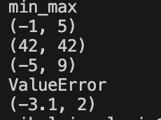
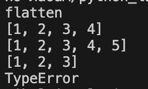
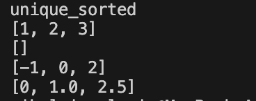
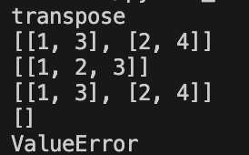
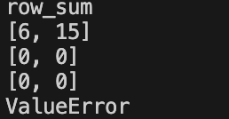
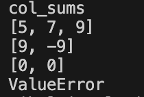
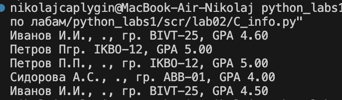

#Лабораторные работы

#Лабораторная работа №1
## Задание 1

```python
a = (input('Имя:'))
b = int(input('Возраст:'))
print('Привет,'+ str(a) + '! Через год тебе будет'+ str(b+1)+'.')
```


## Задание 2

```python
a = float(input("a: ").replace(',', '.'))
b = float(input("b: ").replace(',', '.'))
print('sum='+str(a+b)+'; avg='+str((a+b)/2))
```


## Задание 3

```python
price = int(input('Стоимость $:'))
discount = int(input('Скидка, %:'))
vat = int(input('НДС:'))
base = price * (1 - discount/100)
vat_amount = base * (vat/100)
total = base + vat_amount
print('База после скидки:', base)
print('НДС:',vat_amount)
print('Итого к оплате:',total)
```


## Задание 4

```python
minutes_input = int(input('Минуты:'))
hour = 60
hours = minutes_input//hour
minutes = minutes_input-(hours*hour)
print(f'{hours}:{minutes:02d}')
```


## Задание 5

```python
full_name = input()
cleaned_name = ' '.join(full_name.split())
x = full_name.split()
print(f'ФИО:{cleaned_name}')
print(f'Инициалы:{x[0][0]}{x[1][0]}{x[2][0]}.')
print(f'Длина (символов):{len(cleaned_name)}')
```


#Лабораторная работа №2

# Задание A_min_max

```python
def min_max(nums: list[float | int]) -> tuple[float | int, float | int]:
    try:
        return tuple([min(nums), max(nums)])
    except ValueError:
        return 'ValueError'
print('min_max')
print(min_max([3, -1, 5, 5, 0]))
print(min_max([42]))
print(min_max([-5, -2, 9]))
print(min_max([]))
print(min_max([1.5, 2, 2.0, -3.1]))
```


# Задание A_flatten

```python
def flatten(mat: list[list | tuple]) -> list:
    spisok = list()
    for i in range(len(mat)):
        if isinstance(mat[i], list) or isinstance(mat[i], tuple):
            for j in mat[i]:
                spisok.append(j)
        else:
            return 'TypeError'
    return spisok
print('flatten')
print(flatten([[1, 2], [3, 4]]))
print(flatten(([1, 2], (3, 4, 5))))
print(flatten([[1], [], [2, 3]]))
print(flatten([[1, 2], "ab"]))
```


# Задание A_unique_sorted

```python
def unique_sorted(nums: list[float | int]) -> list[float | int]:
    n = sorted(list(set(nums)))
    return n
print('unique_sorted')
print(unique_sorted([3, 1, 2, 1, 3]))
print(unique_sorted([]))
print(unique_sorted([-1, -1, 0, 2, 2]))
print(unique_sorted([1.0, 1, 2.5, 2.5, 0]))
```


# Задание B_transpose
```python
def transpose(mat: list[list[float | int]]) -> list[list]:
    if not mat:
       return []
    
    row_len = len(mat[0])
    for row in mat:
        if len(row) != row_len:
            return 'ValueError'
    
    return [[mat[r][c] for r in range(len(mat))] for c in range(row_len)]
print('transpose')
print(transpose([[1, 2], [3, 4]]))
print(transpose([[1], [2], [3]]))
print(transpose([[1, 2], [3, 4]]))
print(transpose([]))
print(transpose([[1, 2], [3]]))
```


# Задание B_row_sums
```python
def row_sums(mat: list[list[float | int]]) -> list[float]:
    if not mat:
        return []
    
    row_len = len(mat[0])
    for row in mat:
        if len(row) != row_len:
            return 'ValueError'
        
    return [sum(i) for i in mat]

print('row_sum')
print(row_sums([[1, 2, 3], [4, 5, 6]]))
print(row_sums([[-1, 1], [10, -10]]))
print(row_sums([[0, 0], [0, 0]]))
print(row_sums([[1, 2], [3]]))
```


# Задание B_col_sums
```python
def transpose(mat: list[list[float | int]]) -> list[list]:
    if not mat:
        return []
    row_len = len(mat[0])
    for row in mat:
        if len(row) != row_len:
            return 'ValueError'
    
    return [[mat[r][c] for r in range(len(mat))] for c in range(row_len)]


def row_sums(mat: list[list[float | int]]) -> list[float]:
    if not mat:
        return []
    
    row_len = len(mat[0])
    for row in mat:
        if len(row) != row_len:
            return 'ValueError'
        
    return [sum(i) for i in mat]


def col_sums(mat: list[list[float | int]]) -> list[float]:
    if not mat:
        return []
    
    row_len = len(mat[0])
    for row in mat:
        if len(row) != row_len:
            return 'ValueError'
    
    mat = transpose(mat)
        
    return [sum(i) for i in mat]

print('col_sums')
print(col_sums([[1, 2, 3], [4, 5, 6]]))
print(col_sums([[-1, 1], [10, -10]]))
print(col_sums([[0, 0], [0, 0]]))
print(col_sums([[1, 2], [3]]))
```


# Задание C_info

```python
def info(fio: str, group: str, gpa: float) -> tuple:
    if not isinstance(fio, str):
        raise TypeError("fio должно быть строкой")
    if not isinstance(group, str):
        raise TypeError("group должно быть строкой")
    if not isinstance(gpa, (float, int)):
        raise TypeError("gpa должно быть числом")
    
    return ((lambda p: f"{p[0].capitalize()} {p[1][0].upper()}.{''+p[2][0].upper()+'.' if len(p)>2 else ''}")( [x.capitalize() for x in fio.strip().split() if x] ), group, f"{gpa:.2f}")

def format_record(rec: tuple[str, str, float]) -> str:
    fio, group, gpa = rec
    inf = info(fio, group, gpa)
    answer = ''
    for _ in inf:
        answer += str(_)+ ', '
    return answer[:-2]

print('format_record')
print(format_record(("Иванов Иван Иванович", "BIVT-25", 4.6)))
print(format_record(("Петров Пётр", "IKBO-12", 5.0)))
print(format_record(("Петров Пётр Петрович", "IKBO-12", 5.0)))
print(format_record(("   крынецкая  галина  сергеевна ", "ABB-01", 3.999)))
```


